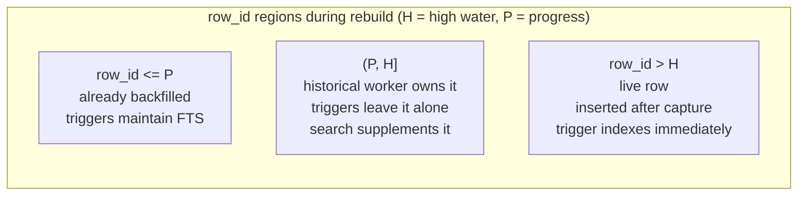

# Session metadata FTS (#25) — stable `row_id` + resumable Unicode external-content index

Status: **implemented** — #25 on `fts/session-row-id-unicode-migration`, its
optional CJK variant (#26) on `fts/session-cjk-highwater`.

This documents the architecture shipped by #25 and the invariants later tickets
(#26 CJK, #27 unified lifecycle/storage settlement, #30 normalized trigram) build on.
Research context: [`docs/research/issue-32-stable-row-id-unicode-session-fts.md`](../research/issue-32-stable-row-id-unicode-session-fts.md).

## What changed

1. `sessions` gained a named `row_id INTEGER PRIMARY KEY AUTOINCREMENT` while
   `id TEXT NOT NULL UNIQUE` stays the logical/public identity. Legacy hidden
   `rowid` values are copied verbatim into `row_id` (deleted-row holes
   preserved), in one `BEGIN IMMEDIATE` transaction.
2. `sessions_fts` is now **external-content** over the raw canonical
   `(title, id, display_name)` tuple, keyed by `content_rowid='row_id'`,
   `tokenize='unicode61'`. No normalization or synthetic concatenation
   (that is #30's scope).
3. Startup no longer runs a blocking one-shot Unicode backfill. It stages a
   durable H/P claim (`fts_session_rebuild_high_water` / `..._progress`) and
   the historical rows are backfilled by the resumable chunk engine, sharing
   the message rebuild's crash-safe claim/repair/finish rules and its single
   monkeypatchable pause helper.
4. The sessions_fts upgrade is **decoupled from the message-FTS layout**: it
   runs on BOTH the legacy v22-inline-messages path and the v23 path.
   `_migrate_sessions_row_id()` rebuilds `sessions` via `DROP TABLE`, which
   carries away any pre-#25 `sessions_fts_*` triggers with it — so the
   sessions ensure must not live inside the message `else` branch, or a
   legacy-message DB would strand the old internal title-only `sessions_fts`
   with no triggers and no H/P claim.

## Ownership model

A session's `row_id` determines who may touch its FTS document while a rebuild
is pending:

The live triggers gate on `row_id > H OR row_id <= P`; when no rebuild is
pending both markers are absent and `COALESCE(..., -1)` makes the gate a
tautology (normal operation). This makes every existing canonical
session-delete path correct without a second manual FTS delete path:

- deleting `<= P` removes the already-indexed document;
- deleting `(P, H]` issues no external-content delete (the document was never
  indexed) and the later range backfill simply finds no canonical row;
- deleting `> H` removes the live-indexed document.

## Crash-safe H/P rebuild

Reuses the accepted message-FTS seam (upstream #76832):

- durable claim is committed **before** an empty external index can look
  complete;
- an internal→external conversion over a DB with **zero sessions** stages no
  claim at all (and clears any stale one): the index is complete by
  construction, and an `H=0/P=0` pair would never enter the rebuild (status
  total ≤ 0) yet would leave `optimize_fts_storage` permanently pending as
  `backfill_incomplete`;
- when the external table is created, the schema install (CREATE VIRTUAL
  TABLE + the three gated triggers) AND the **transition catch-up** land in
  ONE crash-atomic `BEGIN IMMEDIATE` (DDL executed statement-by-statement —
  `executescript`'s implicit COMMIT would break the transaction). The
  catch-up is a `>H OR <=P` insert with a docsize anti-join whose predicate
  uses `COALESCE(H, -1)` / `COALESCE(P, -1)`, so it also covers the
  no-marker (empty / complete) case: with no markers every `row_id > -1` is
  trigger-owned, catching an empty DB's first window row too. This closes the
  trigger-free window (a concurrent writer committed after the stage
  transaction released the lock but before the triggers existed is caught
  up; a crash mid-transition rolls back schema + catch-up together and the
  reopen re-runs it). Applies to both the internal→external conversion and
  the fresh-create-over-populated path;
- `H` present / `P` missing never replays from zero over a maybe-partial index:
  either a proven boundary is recovered or the index is reset known-empty
  (`'delete-all'`) first;
- each chunk claims `(P, min(P + _FTS_REBUILD_CHUNK_ROWS, H)]` and publishes
  progress in the same `BEGIN IMMEDIATE` transaction (crash-atomic, and two
  concurrent runners interleave disjoint chunks);
- finish runs a narrow docsize anti-join boundary sweep before clearing the
  markers.

## Search during migration

`_fts_metadata_candidates(raw_query)` is the raw Unicode lane over
`(title, id, display_name)`. While the backfill is pending it supplements only
the bounded gap `(P, H]` from canonical rows and deduplicates by `row_id`, so
migration never silently hides a matching session. It is wired into the
production title-lineage resolution path (`_fts_numbered_variants` delegates to
it for non-CJK titles), and `list_sessions_rich(search_query=...)` now also
matches the raw `display_name` dimension. The existing normalized / infix
`%LIKE%` fallback is preserved until #30 deliberately replaces it.

Gap semantics approximate the index conservatively as a **superset of the FTS
predicate**: the supplement folds both sides with `_fts_unicode61_fold` (NFKD
decompose + drop combining marks + casefold) instead of SQLite's ASCII-only
`LOWER()`, and matches on ANY positive term extracted from the query
(`_fts_query_positive_terms` — multi-token implicit AND, `OR`, quoted phrases,
prefix `*`), so `MATCH 'ecole'` finds `École` in the gap and `MATCH 'Alpha
Project'` finds a gap row titled `Alpha middle Project` exactly as the indexed
lane would. Terms split on an ASCII-only separator boundary (unicode61 always
treats ASCII non-alphanumerics — whitespace, punctuation, notably `_` — as
separators); every non-ASCII character is kept inside terms, because Python's
`unicodedata` cannot mirror SQLite's unicode61 (Unicode 6.1) — e.g. U+1018C
is a token char in unicode61 but category `So` in Python, so excluding by
category would risk a miss. Non-ASCII runs also emit each ASCII sub-run and
each non-ASCII codepoint, so a query unicode61 tokenizes more finely cannot
miss either. The sanitizer-quoted `[._-]` punctuation is a separator
too: `foo_bar` / `foo-bar` / `foo.bar` all yield the terms (`foo`, `bar`)
exactly as the index tokenizes a `foo bar` document — a term that kept `_` as
a literal would MISS a session the FTS lane finds. Boolean operator words
(`and`/`or`/`not`/`near`) are deliberately kept as terms too: a quoted
`"AND"` is a literal FTS phrase (the sanitizer protects balanced quotes), so
stripping them would empty the terms for that query and hide a matched row —
keeping them can only over-match, never miss. Over-matching is accepted
(the backfilled index restores exact semantics); a MISS is not. The fold is deliberately a conservative Unicode
approximation, NOT exact unicode61 parity (the real tokenizer folds per
Unicode 6.1, strips Latin-script diacritics, and preserves single-codepoint
multi-diacritic characters such as `ộ`), so the gap lane can produce a
temporary false positive that disappears after backfill — accepted, because
#25's core risk is migration MISSING a result. The merged FTS+gap result is
sorted globally by `started_at DESC` (never lane-then-gap), which is what
`resolve_session_by_title` relies on to resume the latest continuation. The
helper returns `(fts_ok, candidates)`: when the `sessions_fts` MATCH lane
itself fails, `fts_ok` is False so title resolution falls back to the LIKE
lane instead of trusting a partial result.

Numbered-title resolution (issue #15) validates candidates with a strict
literal grammar — `base + " #" + ASCII integer` — in BOTH the FTS post-filter
and the LIKE fallback, so a `%` / `_` / `\` in the base stays literal and a
non-numeric suffix such as `foo #bar` is never treated as a continuation.
The SQL LIKE escape (`hermes_state_common.escape_like`) is used only for the
SQL wildcard match; the Python literal check always uses the raw base.

## CJK variant (issue #26)

`sessions_fts_cjk` is an **optional CJK specialization** of the same
architecture: the same external-content raw `(title, id, display_name)`
document keyed by the same named `row_id`, but tokenized with the loadable
`cjk_unicode61` bigram tokenizer. It does not get a second scheduler — it
reuses the generic `_FTS_*_SPEC` chunk/finish/repair/pacing engine with its
own spec.

The one structural difference from Unicode is capability: the tokenizer is an
optional loadable extension, so **worker operability** (can this process build
/maintain the index) is a separate in-process fact from **search-serving
availability** (is the index complete, non-stale, and queryable). A pending
backfill is a valid `worker-operable = true, search-serving = false` state and
the worker must still advance there — the donor deadlock that a single
conflated boolean caused. Durable state is independent:
`fts_session_cjk_rebuild_high_water` / `_progress` / `fts_session_cjk_stale`
— never the Unicode-session pair, never the message-CJK pair.

Degradation rules (pinned by tests):

- A tokenizer-less host drops the unsafe CJK triggers only after persisting
the stale breadcrumb, and **never clears pending H/P** — missing local
capability is not evidence of completion.
- A stale index (unknown post-drop gap) is never served and its triggers are
not blindly reinstalled; a later capable host resets it to a known-empty
surface and reseeds a fresh CJK H/P from current `MAX(row_id)`.
- `#77629`: the same operability capability that gates the chunk step gates
finish; only a successful boundary-sweep finish clears the CJK markers and
flips search-serving on.
- Pending/stale/unavailable CJK and lone single-CJK-character queries are
served by the canonical Unicode/LIKE fallback — never a partial index.
`_fts_cjk_metadata_candidates` returns `(servable, candidates)` so a valid
zero-match is distinct from unservable (the seam #14 will route on).
- All CJK MATCH runs through `_read_ctx()`; the dedicated
`SessionDB(read_only=True)` attach probes/loads the tokenizer per connection,
degrading to fallback on failure.

The tokenizer ships as a loadable extension built from
`native/fts5_cjk/fts5_cjk.c` (`build.sh` on Linux; a Windows `.dll` via
mingw). The CJK tests build it on the fly in CI or honor a prebuilt
`HERMES_FTS5_CJK_SO` artifact.

## Files

- `hermes_state_common.py` — `SESSIONS_FTS_SQL` (external DDL + gated narrow
  triggers), `SESSIONS_FTS_CJK_TABLE_SQL` / `SESSIONS_FTS_CJK_TRIGGER_SQL`
  (split CJK DDL + gated narrow triggers), `_FTS_SESSION_CJK_TRIGGERS`,
  `FTS_SESSION_CJK_STALE_KEY`, `SESSION_TABLE_REBUILD_SQL` /
  `SESSION_INDEX_SQL_STATEMENTS` (the unique title index is deliberately
  excluded: the existing post-migration duplicate-title repair owns it).
- `hermes_state.py` — `_migrate_sessions_row_id`, `_ensure_sessions_fts_schema`,
  `_fts_session_schema_transition`, `_db_has_internal_content_sessions_fts`,
  `_ensure_sessions_fts_cjk_schema`, `_fts_session_cjk_schema_transition`,
  `_db_has_internal_content_sessions_fts_cjk`, `_session_fts_rebuild_gap`,
  `_fts_unicode61_fold`, `_fts_query_positive_terms`, `_fts_metadata_candidates`
  (returns `(fts_ok, candidates)` sorted globally; the gap supplement is a
  term-superset of the FTS predicate), `_fts_cjk_metadata_candidates` (returns
  `(servable, candidates)`; unservable on pending/stale/unavailable/lone-char),
  updated `_fts_numbered_variants`.
- `hermes_state_schema.py` — `_init_schema` wiring: the sessions-FTS block is
  placed OUTSIDE the message legacy/`else` branch so it runs for every message
  layout (the `fts_storage_version` stamp stays message-scoped; unified
  storage-version settlement is #27).
- `hermes_state_search.py` — shared `_FTS_MESSAGE_SPEC` / `_FTS_SESSION_SPEC` /
  `_FTS_SESSION_CJK_SPEC`, parameterized `fts_rebuild_status/step`,
  `_fts_rebuild_finish` (honors the spec's operability gate + `finish_hook`;
  the session-CJK hook gates search-serving on "not stale"),
  `_seed_fts_rebuild_markers` / `_seed_session_spec_rebuild_markers`,
  `_repair_missing_progress` (the shared crash-safe repair) /
  `_repair_session_spec_bookkeeping`, `_fts_reset_stale_cjk_surface` /
  `_fts_cjk_reset_if_stale` / `_fts_session_cjk_reset_if_stale`,
  `_fts_rebuild_pause`, `fts_optimize_available` / `optimize_fts_storage`
  session (+ session-CJK) phase.
- `hermes_cli/session_recovery.py` — session Unicode + CJK markers treated as
  generated / pending in offline recovery.
- `tests/test_session_metadata_fts.py` — rowid-hole migration (incl. legacy
  duplicate-title upgrade), raw Unicode external-content, H/P ownership
  regions, crash/restart (incl. the partial-index H-without-P orphan
  reset/replay regression), the crash-atomic schema+catch-up transition
  (two-connection window regressions for the internal→external, fresh-create,
  empty-first-row, and populated crash-reopen paths),
  bounded-gap search (conservative Unicode-fold supplement + its explicit
  non-parity edge, multi-token implicit-AND and OR no-hide regressions,
  sanitizer-quoted `[._-]` punctuation + quoted-boolean + PUA/U+1018C
  no-hide regressions, cross-lane ordering), finish, delete probes that read
  the index directly plus an ordinary internal integrity-check mid-migration
  and a `rank=1` consistency check on completed indexes, two real concurrent
  runners (thread + barrier), shared throttle, and a legacy-message ×
  old-session-FTS cross-layout upgrade path (one optimize settles both) plus
  the empty-legacy-DB no-zombie-marker path.
